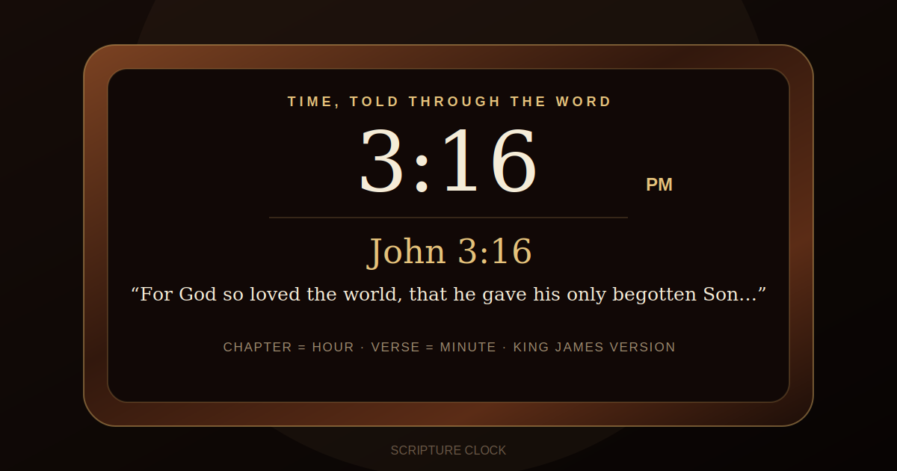

# Scripture Clock — KJV

A polished, installable web clock that tells time through Scripture.

**Chapter = hour. Verse = minute.** At 3:16, the clock looks for a 3:16 Bible reference and features John 3:16 as its signature reading.



## What it does

- Updates the Scripture reading every minute using the visitor's local time.
- Uses exact chapter-and-verse matches whenever they exist.
- Clearly labels a real, chapter-matched fallback when an exact reference does not exist—never fabricating a verse.
- Maps minute `00` to verse `1` at the top of each hour.
- Loads the complete KJV JSON dataset and displays the actual number of verses loaded.
- Rotates among matching books by date, while always featuring John 3:16 at 3:16.
- Includes an optional minute chime, sharing, fullscreen display, responsive design, offline caching, and PWA installation.
- Requires no framework, build process, API key, or paid service.

## Run locally

The service worker and remote KJV request require an HTTP server rather than opening `index.html` directly.

```bash
python -m http.server 8080
```

Then open `http://localhost:8080`.

## Publish with GitHub Pages

1. In the repository, open **Settings → Pages**.
2. Under **Build and deployment**, choose **GitHub Actions**.
3. The included workflow will deploy the site automatically.

## Scripture data

The app requests `verses-1769.json` from the archived `farskipper/kjv` repository through jsDelivr, with the GitHub raw file as a fallback. That repository identifies its KJV JSON data as public domain and distributes it under the Unlicense. Review rights requirements for any jurisdiction and commercial use case before releasing a physical or paid product.

The app code in this project is MIT licensed. The Scripture text remains subject to the source dataset's terms and any applicable local law.

## Important product note

The phrase “world's first” is not used in the interface because it is a factual marketing claim that would need independent substantiation. A safer product line is:

> **Time, told through the Word.**

## Customize

- Change the brand copy in `index.html`.
- Adjust the wood tones in the CSS variables at the top of `styles.css`.
- Add signature times in `FEATURED_REFERENCES` inside `app.js`.
- Replace the KJV source by changing `DATA_SOURCES` in `app.js`.
